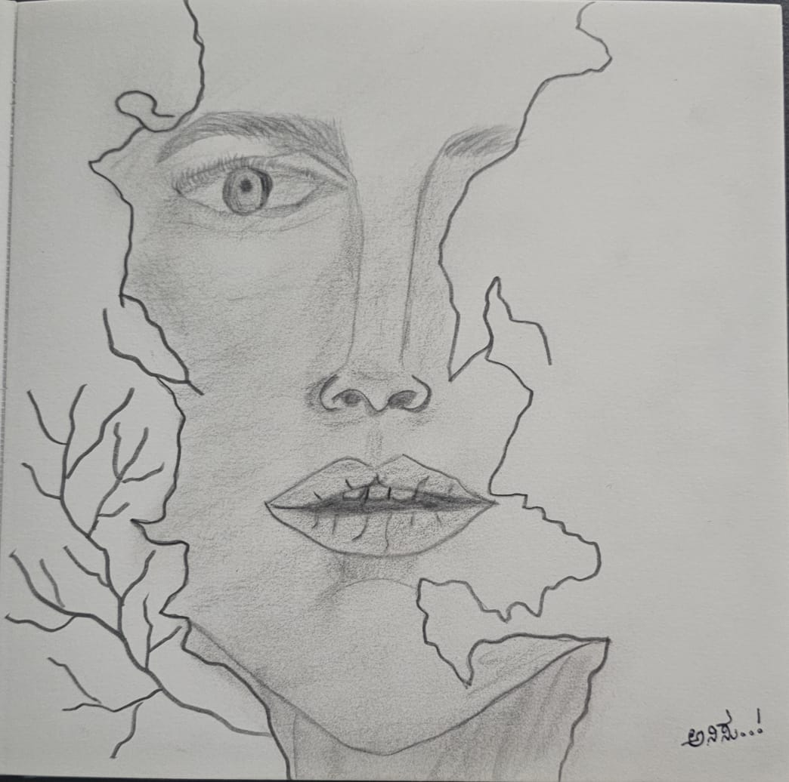

# Scattered Notes

<figure><figcaption>
"Ink. Intent. Infinite."
</figcaption></figure>

> _"ವಿಚಾರ, ಅನುಭವ ಮಟ್ಟು ಸಹಸ — ಈ ಮೂರು ಜೀವನದಳ್ಳಿ ಬೆಳವಿಕೆಗೆ ಬೆಜರಿಲ್ಲಾದ ಸಖಿಗಳು."_\
> — **K. Poornachandra Tejaswi**
>
> _“Creativity begins where comfort ends. If you wish to discover new worlds, be ready to leave the ones you know.”_\
> — _Adapted from Kuvempu's spirit of “Vishwamanava”_
>
> _“Stay hungry. Stay foolish.”_\
> — **Steve Jobs**
>
> _"Obstacles cannot crush me. Every obstacle leads to stern resolve. He who is fixed to a star does not change his mind."_\
> — **Leonardo da Vinci**

***

### 🎯 Purpose

Welcome to my Scattered Notes — a personal collection of unorganized notes that would help others prepare fast in ample time.

### 🧠 Elevator Pitch (WIP)

⏱️ 30-Second Version

[Inspired from:](https://stephanosterburg.gitbook.io/scrapbook)&#x20;

> As you begin drafting your elevator pitch, here are a few things to focus on:
>
> 1. Your background; including the technical aspects of your background where applicable
> 2. Your transition into your field of study; highlighting why you love it
> 3. What value you bring
> 4. What you're building
>
> If you're looking for inspiration, here are a few questions to ask yourself:
>
> * What am I good at?
> * What problems have I solved?
> * Why do I want to be a \[developer/data scientist, etc.]?
> * What was my first exposure to \[code/big data, etc.]?
> * What am I passionate about?
> * What was my ‘AHA’ moment to pivot into my new field of study?



I am a Machine Learning Engineer. I recently finished my MS in AI and robotics at ASU and want to combine my years of experience in Software engineering and AI/ML. Right now, I am working on finishing small side projects using machine learning and deep learning to deploy in cloud environments and build an end-to-end pipeline. I believe that my experience in vision and language models would be an add-on advantage for my next role.



I am a Machine Learning Engineer with a recent MS in AI and Robotics from ASU. I aim to leverage my extensive background in Software Engineering alongside my expertise in AI/ML. Currently, I’m focusing on completing side projects that involve deploying machine learning and deep learning models in cloud environments and developing end-to-end pipelines. My experience with vision and language models is a unique strength I look forward to bringing to my next role.



***

### 📎 Final Thought

This isn’t a perfect resource.\
It’s not a tutorial series or a course.\
It’s just **a reflection of the journey**, with all its highs, errors, and iterations.

If you stumble on this, I hope it helps you too. If not, it’ll help me one day when I forget what a decorator does in Python... again.
