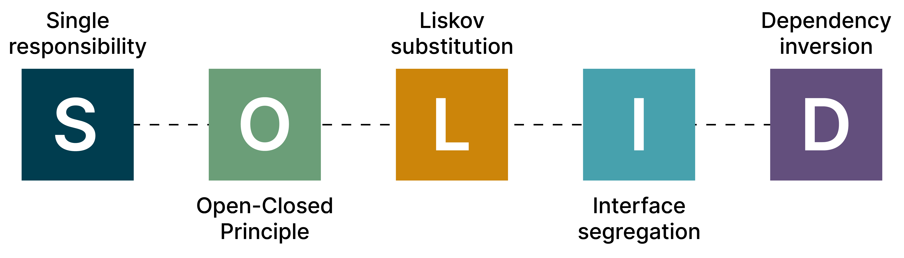
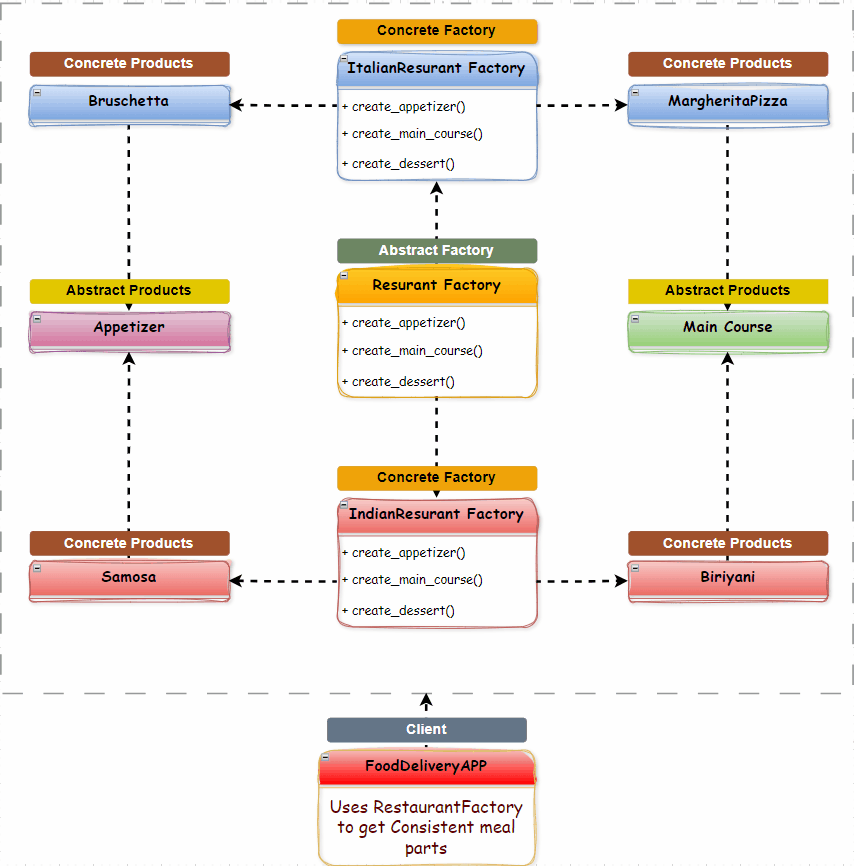
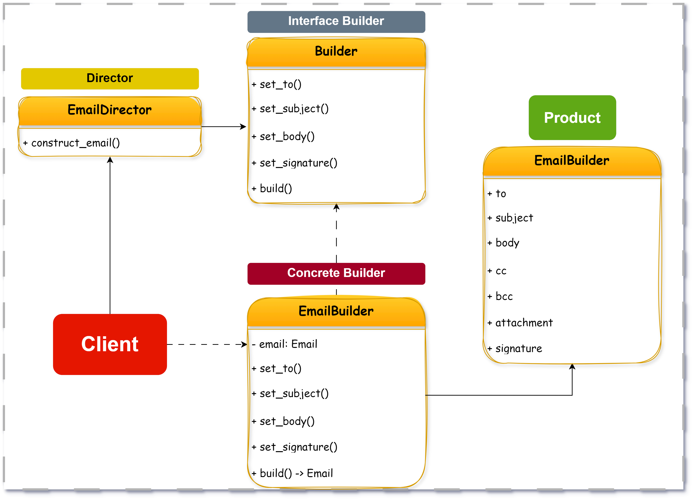
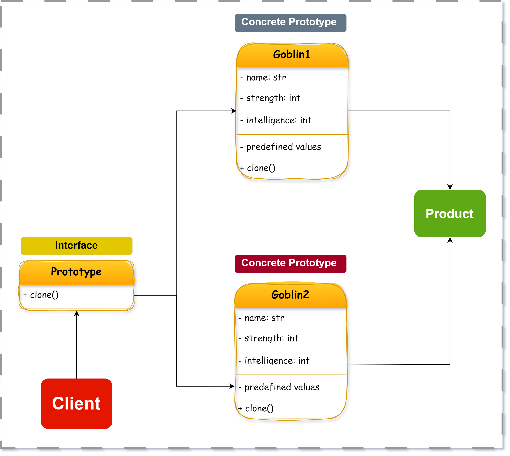

# Creational Design Patterns

## Singleton

> A design pattern that guarantees a class has only one instance and is used as a global point of access to it.
>
> That is the one class will instantiate itself and make sure to create one instance.

<figure><figcaption></figcaption></figure>

Singletons are the simplest patterns, but harder to implement. There are multiple ways to implement the Singleton pattern.


For Detailed explanation: [https://blog.algomaster.io/p/singleton-design-pattern](https://blog.algomaster.io/p/singleton-design-pattern)

For codes in Python: [https://github.com/ashishps1/awesome-low-level-design/tree/main/design-patterns/python/singleton](https://github.com/ashishps1/awesome-low-level-design/tree/main/design-patterns/python/singleton)


### 1. Lazy Initialization

* The singleton instance is created only when it is first requested.
* Saves memory if the instance is never used.
* Simple to implement, but not thread-safe in its basic form.

### 2. Thread-safe Singleton&#x20;

* Ensures only one instance is created, even in multithreaded environments.
* Uses a mutex or lock to synchronize access during instance creation.
* Slightly slower due to locking overhead.

### 3. Double-check locking

* Reduces locking overhead by checking the instance twice: before and after acquiring the lock.
* Thread-safe and more efficient than always locking.
* Slightly more complex to implement correctly

### 4. Eager initialization

* The instance is created at program startup, regardless of whether it’s used.
* Simple and inherently thread-safe.
* It may waste resources if the instance is never needed.

### 5. Bill Pugh Singleton

* Uses a static local variable or inner class for lazy, thread-safe initialization.
* An instance is created only when needed, and thread safety is guaranteed.

### 6. Enum Singleton

* Uses an enum type to guarantee a single instance.
* Simple and prevents issues with serialization and reflection.

### 7. Stack Block Initialization

* Uses a static variable declared inside a method for thread-safe, lazy initialization.
* Simple, efficient, and thread-safe.

### Pros and Cons of the Singleton pattern

| Pros                                                                                            | Cons                                                                                                                     |
| ----------------------------------------------------------------------------------------------- | ------------------------------------------------------------------------------------------------------------------------ |
| 1. Ensures a single instance of a class and provides a global point of access to it.            | 1. Violates the Single Responsibility Principle: The pattern solves two problems at the same time.                       |
| 2. Only one object is created, which can be particularly beneficial for resource-heavy classes. | 2. In multithreaded environments, special care must be taken to implement Singletons correctly to avoid race conditions. |
| 3. Provides a way to maintain global state within an application.                               | 3. Introduces global state into an application, which might be difficult to manage.                                      |
| 4. Supports lazy loading, where the instance is only created when it's first needed.            | 4. Classes using the singleton can become tightly coupled to the singleton class.                                        |
| 5. Guarantees that every object in the application uses the same global resource.               | 5. Singleton patterns can make unit testing difficult due to the global state it introduces.                             |

***

## Factory Method

<figure><figcaption></figcaption></figure>

> The **Factory Method** is a creational design pattern that provides an **interface for creating objects in a superclass**, but **allows subclasses to alter the type of objects that will be created**.
>
> * It delegates the responsibility of object instantiation to subclasses.
> * Helps adhere to the **Open/Closed Principle**: You can introduce new products without modifying existing code.
> * Useful when your code needs to decide which class to instantiate at runtime.

### Simple Factory – Why Not Use It?

A **Simple Factory** is not a formal design pattern in the Gang of Four (GoF) book, but it’s one of the most practical and widely used refactoring techniques in real-world codebases.

In a **simple factory**, you typically use a single method with lots of `if`/`elif`/`switch` statements to create different types of objects based on input.

```python
class Dog:
    def speak(self):
        print("Bark!")

class Cat:
    def speak(self):
        print("Meow!")

class AnimalFactory:
    @staticmethod
    def create_animal(animal_type):
        if animal_type == "dog":
            return Dog()
        elif animal_type == "cat":
            return Cat()
        else:
            raise ValueError("Unknown animal type")

# Usage
animal = AnimalFactory.create_animal("cat")
animal.speak()  # Output: Meow!
```

**Drawbacks of Simple Factory:**

* **Violates Open/Closed Principle**: You must modify the `create_animal()` method each time a new type is added.
* Harder to maintain: One centralized function with many conditionals.
* Not extensible: Client code can’t easily extend behavior without editing the factory.

### Enter: Factory Method

Instead of using if-else logic in one place, Factory Method pushes object creation to **subclasses** via a dedicated method.

#### **Structure:**

* **Product**: Base interface or abstract class.
* **ConcreteProduct**: Actual classes implementing the Product.
* **Creator**: Abstract class defining the factory method.
* **ConcreteCreator**: Subclass that overrides factory method to return a specific ConcreteProduct.

```python
from abc import ABC, abstractmethod

# Product interface
class Animal(ABC):
    @abstractmethod
    def speak(self):
        pass

# Concrete Products
class Dog(Animal):
    def speak(self):
        print("Bark!")

class Cat(Animal):
    def speak(self):
        print("Meow!")

# Creator (Abstract Factory)
class AnimalFactory(ABC):
    @abstractmethod
    def create_animal(self):
        pass

# Concrete Creators
class DogFactory(AnimalFactory):
    def create_animal(self):
        return Dog()

class CatFactory(AnimalFactory):
    def create_animal(self):
        return Cat()

# Usage
factory = CatFactory()
animal = factory.create_animal()
animal.speak()  # Output: Meow!
```

#### Why It’s Better

* **Open/Closed Principle**: Easily add new products without touching existing code.
* **Separation of concerns**: Each class has a single responsibility.
* **Extensibility**: Clients can introduce new products by subclassing.

#### When to Use Factory Method

* When the exact type of object needs to be determined at **runtime**.
* When you need to **delegate instantiation logic** to subclasses.
* When your system must support **plug-and-play product families**.

### Pros and Cons

| Pros                                                                                                 | Cons                                                         |
| ---------------------------------------------------------------------------------------------------- | ------------------------------------------------------------ |
| Adheres to the **Open/Closed Principle** – new products can be added without modifying existing code | Introduces **more classes** compared to simple factories     |
| **Decouples client code** from concrete product implementations                                      | Can be **overkill** for simple object creation scenarios     |
| Each **creator subclass** can have its **own specialized logic**                                     | Slightly **higher learning curve** due to use of inheritance |

***

## Abstract Factory

> The **Abstract Factory** is a **creational design pattern** that provides an interface for creating **families of related or dependent objects**, without specifying their concrete classes.

### When to Use

Use this pattern when:

* You need to create **related objects that are always used together**, such as UI elements (e.g., button + checkbox).
* You want to support **multiple product variants**, such as for **different platforms or configurations** (Windows/macOS/Linux; Android/iOS).
* You want to **enforce consistency** across products that come from the same "factory".
* You want to **isolate object creation** to easily switch product families at runtime.

### The Problem – Food Delivery App

You're building a **food delivery application** that supports multiple restaurants. Each restaurant offers a **consistent family of menu items**:

* **Appetizer**
* **Main Course**
* **Dessert**

You want to ensure that switching from Italian to Mexican cuisine automatically shows the appropriate, consistent set of menu items.

#### Naive Implementation :

```python
# Italian Menu
class ItalianAppetizer:
    def create(self):
        print("Bruschetta")

class ItalianMainCourse:
    def create(self):
        print("Margherita Pizza")

class ItalianDessert:
    def create(self):
        print("Tiramisu")

# Mexican Menu
class MexicanAppetizer:
    def create(self):
        print("Guacamole")

class MexicanMainCourse:
    def create(self):
        print("Tacos")

class MexicanDessert:
    def create(self):
        print("Churros")

# Client code (Tightly coupled)
def order_meal(cuisine):
    if cuisine == "italian":
        appetizer = ItalianAppetizer()
        main_course = ItalianMainCourse()
        dessert = ItalianDessert()
    elif cuisine == "mexican":
        appetizer = MexicanAppetizer()
        main_course = MexicanMainCourse()
        dessert = MexicanDessert()
    else:
        raise ValueError("Unsupported cuisine")

    appetizer.create()
    main_course.create()
    dessert.create()

# Usage
order_meal("italian")
order_meal("mexican")
```

This works, but…

* Tightly coupled to specific classes
* No abstraction or polymorphism
* Code repetition
* Violates the **Open/Closed Principle** – adding new cuisines requires editing client logic

#### What We Actually Need

* Group related components together as **families**
* Use polymorphism to treat components generically
* Encapsulate platform- or cuisine-specific creation logic
* Add new products or product families **without changing core logic**

### Enter: Abstract Factory

#### Class Diagram Overview

<figure><figcaption></figcaption></figure>

<table><thead><tr><th width="189.10089111328125">Component</th><th>Description</th></tr></thead><tbody><tr><td><strong>Abstract Factory</strong></td><td><code>RestaurantFactory</code> – defines <code>create_appetizer()</code>, <code>create_main_course()</code>, <code>create_dessert()</code></td></tr><tr><td><strong>Abstract Products</strong></td><td><code>Appetizer</code>, <code>MainCourse</code>, <code>Dessert</code></td></tr><tr><td><strong>Concrete Factories</strong></td><td><code>ItalianRestaurantFactory</code>, <code>MexicanRestaurantFactory</code>, <code>BakeryFactory</code></td></tr><tr><td><strong>Concrete Products</strong></td><td><code>Bruschetta</code>, <code>Tacos</code>, <code>Croissant</code>, etc.</td></tr><tr><td><strong>Client</strong></td><td>Food delivery app that works with abstract interfaces<br></td></tr></tbody></table>

#### Abstract Factory Implementation

```python
from abc import ABC, abstractmethod

# Abstract Products
class Appetizer(ABC):
    @abstractmethod
    def prepare(self): pass

class MainCourse(ABC):
    @abstractmethod
    def prepare(self): pass

class Dessert(ABC):
    @abstractmethod
    def prepare(self): pass

# Concrete Products - Italian
class Bruschetta(Appetizer):
    def prepare(self): print("Preparing Bruschetta")

class MargheritaPizza(MainCourse):
    def prepare(self): print("Baking Margherita Pizza")

class Tiramisu(Dessert):
    def prepare(self): print("Serving Tiramisu")

# Concrete Products - Mexican
class Guacamole(Appetizer):
    def prepare(self): print("Preparing Guacamole")

class Tacos(MainCourse):
    def prepare(self): print("Assembling Tacos")

class Churros(Dessert):
    def prepare(self): print("Frying Churros")

# Abstract Factory
class RestaurantFactory(ABC):
    @abstractmethod
    def create_appetizer(self): pass

    @abstractmethod
    def create_main_course(self): pass

    @abstractmethod
    def create_dessert(self): pass

# Concrete Factories
class ItalianRestaurantFactory(RestaurantFactory):
    def create_appetizer(self): return Bruschetta()
    def create_main_course(self): return MargheritaPizza()
    def create_dessert(self): return Tiramisu()

class MexicanRestaurantFactory(RestaurantFactory):
    def create_appetizer(self): return Guacamole()
    def create_main_course(self): return Tacos()
    def create_dessert(self): return Churros()

# Client
def order_meal(factory: RestaurantFactory):
    appetizer = factory.create_appetizer()
    main = factory.create_main_course()
    dessert = factory.create_dessert()

    appetizer.prepare()
    main.prepare()
    dessert.prepare()

# Usage
order_meal(ItalianRestaurantFactory())
order_meal(MexicanRestaurantFactory())

```

#### What We Achieved

* **Consistency**: Each cuisine has a full set of related dishes.
* **Platform/Cuisine independence**: App logic works regardless of restaurant type.
* **Open/Closed Principle**: New cuisines can be added without touching client logic.
* **Polymorphism**: Client works with abstract interfaces, not concrete classes.

### Pros and Cons

| Pros                                                 | Cons                                                                  |
| ---------------------------------------------------- | --------------------------------------------------------------------- |
| Ensures **consistency** across product families      | Adds complexity due to many interfaces and classes                    |
| Supports **easy switching** between product variants | Difficult to add new product types without modifying abstract factory |
| Encourages **separation of concerns**                | Can be **overkill** for simple use cases                              |
| Adheres to **Open/Closed Principle**                 |                                                                       |

***

## Builder

> The **Builder Pattern** is a **creational design pattern** that allows you to **construct complex objects step-by-step**, separating the object construction logic from the final representation.

It provides better control over the construction process and avoids messy constructor overloading or telescoping constructors.

### When to Use

* The object has **many optional parameters**.
* You want to **avoid long/** [Telescoping](https://en.wikipedia.org/wiki/Telescoping_constructor_pattern) **constructors** with too many arguments.
* You want to **build an object step-by-step**, possibly in a specific sequence.
* Object creation should be **decoupled** from its internal representation.

### The Problem – Email or Notification Creation

Imagine building an **Email** object with fields like: `to` , `from` , `subject` ,`body` ,`cc` ,`bcc` , `attachments`,`signature` .

Naive Implementation:

```python
class Email:
    def __init__(self, to, subject, body, cc=None, bcc=None, attachments=None, signature=None):
        self.to = to
        self.subject = subject
        self.body = body
        self.cc = cc
        self.bcc = bcc
        self.attachments = attachments or []
        self.signature = signature

    def send(self):
        print("Sending Email:")
        print(f"To: {self.to}")
        if self.cc:
            print(f"CC: {self.cc}")
        if self.bcc:
            print(f"BCC: {self.bcc}")
        print(f"Subject: {self.subject}")
        print(f"Body:\n{self.body}")
        if self.attachments:
            print(f"Attachments: {', '.join(self.attachments)}")
        if self.signature:
            print(f"\n--\n{self.signature}")
        print("\nEmail sent!\n")

# Simulate client code creating an email
email = Email(
    to="user@example.com",
    subject="Reminder: Team Meeting",
    body="Don't forget the meeting tomorrow at 10 AM.",
    cc="teamlead@example.com",
    bcc=None,
    attachments=["agenda.pdf", "calendar.ics"],
    signature="Thanks,\nTeam Ops"
)

# Send the email
email.send()

```

**Why It’s a Problem**

* Hard to **read** and **maintain**.
* You must remember parameter order or use keyword arguments.
* Adding/removing a parameter means **updating multiple parts** of your codebase.
* Repetitive/boilerplate logic for default values.

### Enter: Builder Pattern

We separate the **construction logic** (builder) from the **Email object itself**.

#### Class Diagram

<figure><figcaption></figcaption></figure>

| Component            | Description                                                                      |
| -------------------- | -------------------------------------------------------------------------------- |
| **Product**          | The complex object being built (e.g., `Email`). Contains many optional fields.   |
| **Builder**          | Abstract interface declaring build steps like `set_to()`, `set_subject()`, etc.  |
| **Concrete Builder** | Implements the builder interface. Handles actual construction of the product.    |
| **Director**         | _(Optional)_ Encapsulates the building logic. Calls builder methods in sequence. |
| **Client**           | Initiates the builder and calls the necessary build steps to get the product.    |

Builder Implementation

```python
# Product
class Email:
    def __init__(self, to=None, subject=None, body=None, cc=None, bcc=None, attachments=None, signature=None):
        self.to = to
        self.subject = subject
        self.body = body
        self.cc = cc
        self.bcc = bcc
        self.attachments = attachments or []
        self.signature = signature

    def send(self):
        print(f"Sending email to {self.to} with subject '{self.subject}'")

# Builder
class EmailBuilder:
    def __init__(self):
        self.email = Email()

    def set_to(self, to):
        self.email.to = to
        return self

    def set_subject(self, subject):
        self.email.subject = subject
        return self

    def set_body(self, body):
        self.email.body = body
        return self

    def set_cc(self, cc):
        self.email.cc = cc
        return self

    def set_signature(self, signature):
        self.email.signature = signature
        return self

    def build(self):
        return self.email

# Client
builder = EmailBuilder()
email = (
    builder.set_to("user@example.com")
           .set_subject("Builder Pattern")
           .set_body("Step-by-step construction.")
           .set_signature("Regards,\nTeam")
           .build()
)
email.send()

```

### Pros and Cons

| Pros                                        | Cons                                        |
| ------------------------------------------- | ------------------------------------------- |
| Supports **step-by-step object creation**   | More code (Builder + Product)               |
| **Avoids telescoping constructors**         | Overkill for simple objects                 |
| Great for **complex configuration objects** | May add complexity for small-scale projects |
| Follows **Single Responsibility Principle** |                                             |

***

## Prototype

The **Prototype Pattern** is a **creational design pattern** that allows you to create new objects **by cloning existing instances**, instead of instantiating from scratch.

“Don’t build from the ground up every time. Copy what’s already working.”

### When to Use

* When object creation is **expensive, slow, or resource-intensive** (e.g., DB connections, deep object hierarchies).
* To avoid **duplicating complex initialization logic**.
* When you need **many similar objects** with only slight differences.
* When creating many objects that share a common structure.

### The problem: Game Character Prototype

In a video game, you often have **base character templates** like:

* **Warrior**
* **Wizards**
* Goblins

Each has default stats, weapons, abilities, and gear. When a new player joins, instead of building these characters from scratch every time (repeating logic), the system **clones a prototype character** and allows the player to customize it slightly (e.g., rename, tweak color or armor).

#### Naive Implementation

```python
class GameCharacter:
    def __init__(self, name, strength, agility, intelligence, equipment):
        self.name = name
        self.strength = strength
        self.agility = agility
        self.intelligence = intelligence
        self.equipment = equipment

# Creating a character manually
goblin1 = GameCharacter("Goblin Grunt", 10, 12, 5, ["Club", "Leather Armor"])
# Want a similar goblin? Duplicate code:
goblin2 = GameCharacter("Goblin Guard", 10, 12, 5, ["Club", "Leather Armor"])

```

#### Why Naive Is a Problem

* Duplicated logic — prone to human error
* Tedious when dozens of characters differ only slightly
* Inflexible for dynamic cloning

#### Cloning Challenges

1. **Encapsulation gets in the way**\
   Private fields or internal states can make copying hard from outside the object.
2. **Class-level dependency**\
   Cloning logic often requires knowledge of the class structure, violating encapsulation.
3. **Interface-only context**\
   If you're working with interfaces, cloning a concrete instance without knowing its type can be difficult.

### Enter: Prototype Pattern

Instead of configuring every new object manually, we define a **prototype** and simply **clone** it when needed.

This can be done via:

* **Shallow copy** (default `copy.copy()`)
* **Deep copy** (using `copy.deepcopy()` for nested structures)

#### Class Diagram

<figure><figcaption></figcaption></figure>

<table><thead><tr><th width="273">Components</th><th></th></tr></thead><tbody><tr><td><strong>Prototype</strong></td><td>Interface declaring a <code>clone()</code> method</td></tr><tr><td><strong>ConcretePrototype</strong></td><td>Implements <code>clone()</code> (e.g., <code>Goblin1, Goblin2</code>)</td></tr><tr><td><strong>Client</strong></td><td>Uses <code>clone()</code> to create new objects from a pre-defined prototype</td></tr><tr><td><strong>Product</strong></td><td>The object being cloned (e.g., <code>GameCharacter</code>)</td></tr></tbody></table>

#### Code

```python
import copy

class GameCharacter:
    def __init__(self, name, strength, agility, intelligence, equipment):
        self.name = name
        self.strength = strength
        self.agility = agility
        self.intelligence = intelligence
        self.equipment = equipment

    def clone(self):
        return copy.deepcopy(self)

    def display(self):
        print(f"{self.name} | STR:{self.strength}, AGI:{self.agility}, INT:{self.intelligence}")
        print(f"Equipment: {', '.join(self.equipment)}\n")

# Prototype Instance
goblin_prototype = GameCharacter("Goblin", 10, 12, 5, ["Club", "Leather Armor"])

# Clone and customize
goblin1 = goblin_prototype.clone()
goblin1.name = "Goblin Grunt"

goblin2 = goblin_prototype.clone()
goblin2.name = "Goblin Captain"
goblin2.equipment.append("Shield")

# Usage
goblin1.display()
goblin2.display()

```

#### What We Achieved

* **Reduced duplication**: No repeated setup code.
* **Flexibility**: Easy to create many variants with small changes.
* **Encapsulation**: Cloning is handled within the object.

### Pros and Cons

| Pros                                                        | Cons                                                        |
| ----------------------------------------------------------- | ----------------------------------------------------------- |
| Avoids reinitializing objects from scratch                  | Cloning logic can get complex if object contains references |
| Faster and cheaper than constructing new complex objects    | Deep vs shallow copy issues for nested/mutable structures   |
| Promotes encapsulation – object manages its own duplication | May violate abstraction if clone depends on concrete type   |
| Good when object creation is **resource-intensive**         | Not ideal for simple objects or stateless classes           |

***
