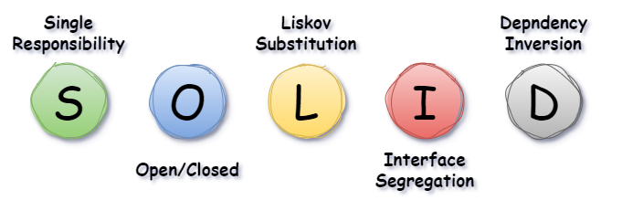

# SOLID Principles

These five software development principles are guidelines to follow when building software so that it is easier to scale and maintain. They were made popular by a software engineer, [Robert C. Martin](https://en.wikipedia.org/wiki/Robert_C._Martin).

<figure><figcaption></figcaption></figure>

### For better visual understanding:

[The S.O.L.I.D Principles in Pictures](https://medium.com/backticks-tildes/the-s-o-l-i-d-principles-in-pictures-b34ce2f1e898)

### The SOLID Principles <a href="#id-29fe" id="id-29fe"></a>

> TO MAKE EASIER AND SIMPLE TO FOLLOW.&#x20;
>
> 1. I WILL BE USING WORD `"CLASS"`  FOR SIMPLICITY.
> 2. THESE BELOW PRINCIPLES CAN ALSO BE APPLIED TO `"FUNCTIONS", "METHOD" OR "MODULE".`

#### S - Single Responsibility Principle (SRP) <a href="#id-8699" id="id-8699"></a>

> A `CLASS` should only have one reason to change. i.e. one responsibility

**Why:** If a `"CLASS"` has multiple responsibilities, changes to one responsibility can unintentionally affect others, increasing the risk of bugs.

**Goal:** Separate behaviors so that changes in one area do not impact unrelated areas.

**Example:** A `Report` class should only handle report generation, not saving or emailing reports. Those should be separate classes.

Violates SRP: Report CLASS handles both authentication and logging.

```python
class Report:
    def generate(self):
        print("Generating report...")

    def save(self):
        print("Saving report to disk...")

    def email(self):
        print("Emailing report...")
```

SRP-compliant: Separate classes for each responsibility

```python
class Report:
    def generate(self):
        print("Generating report...")

class ReportSaver:
    def save(self, report):
        print("Saving report to disk...")

class ReportEmailer:
    def email(self, report):
        print("Emailing report...")

```

***

#### O - Open-Closed Principle (OCP) <a href="#id-3984" id="id-3984"></a>

> A `CLASS` should be open for extension but closed for modification.

**Why:** Modifying existing code can introduce bugs in systems that rely on that code. Instead, extend functionality by adding new code.

**Goal:** Allow a class’s behavior to be extended without changing its existing code, reducing the risk of breaking other parts of the system.

**Example:** Add new features by creating subclasses or using interfaces, rather than altering the original class.

**Violation:** Adding new report formats requires modifying the existing class.

```python
class ReportPrinter:
    def print_report(self, report, format_type):
        if format_type == "PDF":
            print("Printing PDF report...")
        elif format_type == "HTML":
            print("Printing HTML report...")

```

**Correction:** Extend functionality by adding new classes, not modifying existing ones.

```python
from abc import ABC, abstractmethod

class ReportPrinter(ABC):
    @abstractmethod
    def print_report(self, report):
        pass

class PDFReportPrinter(ReportPrinter):
    def print_report(self, report):
        print("Printing PDF report...")

class HTMLReportPrinter(ReportPrinter):
    def print_report(self, report):
        print("Printing HTML report...")

```

***

#### **L -** **Liskov Substitution P**rinciple (LSP)

> If S is a subtype of T, then objects of type T in a program may be replaced with objects of type S without altering any of the desirable properties of that program.

**Why:** If a subclass cannot perform the same actions as its parent, it can cause unexpected bugs.

**Goal:** Ensure that derived classes extend the base class without changing its expected behavior.

**Example:** If a `Coffee` class has a `Cappuccino` subclass, the subclass should behave like a `Coffee` In all contexts where `Coffee` is expected.

**Violation:** A subclass breaks the expected behavior of the base class.

```python
class Coffee:
    def brew(self):
        print("Brewing coffee...")

class Cappuccino(Coffee):
    def brew(self):
        raise Exception("Cappuccino cannot be brewed like regular coffee!")

```

**Correction:** The subclass can be used anywhere the base class is expected.

```python
class Coffee:
    def brew(self):
        print("Brewing coffee...")

class Cappuccino(Coffee):
    def brew(self):
        print("Brewing cappuccino...")

def make_coffee(coffee: Coffee):
    coffee.brew()

make_coffee(Coffee())        # Works
make_coffee(Cappuccino())    # Also works, as expected

```

***

#### **I -** **Interface Segregation** Principle (ISP)

> Classes should not be forced to depend on methods they do not use.

**Why:** Large, general-purpose interfaces force classes to implement unnecessary methods, leading to bloated and fragile code.

**Goal:** Split large interfaces into smaller, client-specific ones so that classes only implement what they need.

**Example:** Instead of one big interface for all printer functions, have separate interfaces for scanning, printing, and faxing.

**Violation:** A single interface forces classes to implement unused methods.

```python
class MultiFunctionPrinter:
    def print(self):
        pass
    def scan(self):
        pass
    def fax(self):
        pass

class SimplePrinter(MultiFunctionPrinter):
    def print(self):
        print("Printing...")
    def scan(self):
        pass  # Not needed
    def fax(self):
        pass  # Not needed

```

**Correction:** Split into smaller, focused interfaces.

```python
class Printer:
    def print(self):
        print("Printing...")

class Scanner:
    def scan(self):
        print("Scanning...")

class Fax:
    def fax(self):
        print("Faxing...")

class MultiFunctionPrinter(Printer, Scanner, Fax):
    pass

class SimplePrinter(Printer):
    pass
```

***

#### **D -** **Dependency Inversion** Principle (DIP)

> High-level modules should not depend on low-level modules. Both should depend on the abstraction.
>
> Abstractions should not depend on details. Details should depend on abstractions.


**High-level Module(or Class)**: A Class that executes an action with a tool.

**Low-level Module (or Class)**: The tool that is needed to execute the action

**Abstraction**: Represents an interface that connects the two Classes.

**Details**: How the tool works


**Why:** Direct dependencies between high-level and low-level modules make code rigid and hard to change.

**Goal:** Reduce coupling by introducing interfaces or abstract classes, making the system more flexible and testable.

**Example:** A `LightSwitch` class should depend on a `SwitchableDevice` interface, not directly on a `LightBulb` class.

**Violation:** High-level class depends directly on a low-level class.

```python
class LightBulb:
    def turn_on(self):
        print("LightBulb ON")
    def turn_off(self):
        print("LightBulb OFF")

class LightSwitch:
    def __init__(self, LightBulb):
        self.bulb = LightBulb
    def operate(self, on):
        if on:
            self.bulb.turn_on()
        else:
            self.bulb.turn_off()

```

**Correction:** Depending on an abstraction/interface.

```python
from abc import ABC, abstractmethod

class SwitchableDevice(ABC):
    @abstractmethod
    def turn_on(self):
        pass
    @abstractmethod
    def turn_off(self):
        pass

class LightBulb(SwitchableDevice):
    def turn_on(self):
        print("LightBulb ON")
    def turn_off(self):
        print("LightBulb OFF")

class LightSwitch:
    def __init__(self, device: SwitchableDevice):
        self.device = device
    def operate(self, on):
        if on:
            self.device.turn_on()
        else:
            self.device.turn_off()

```

***
