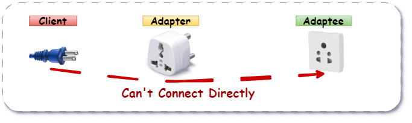
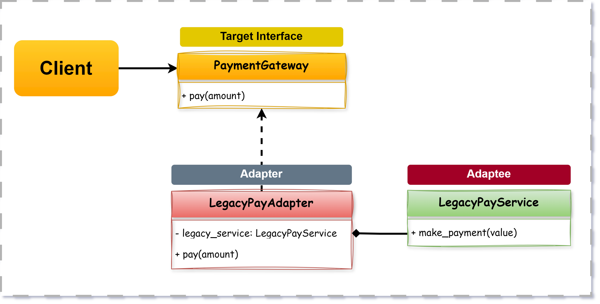
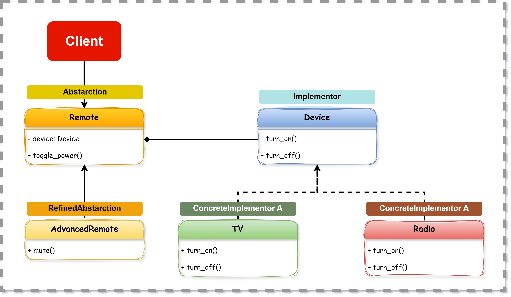
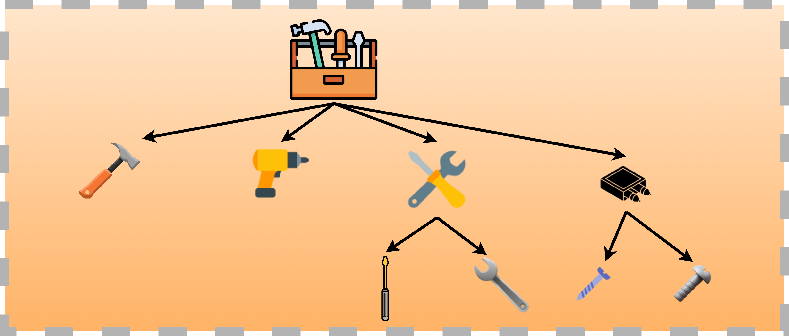
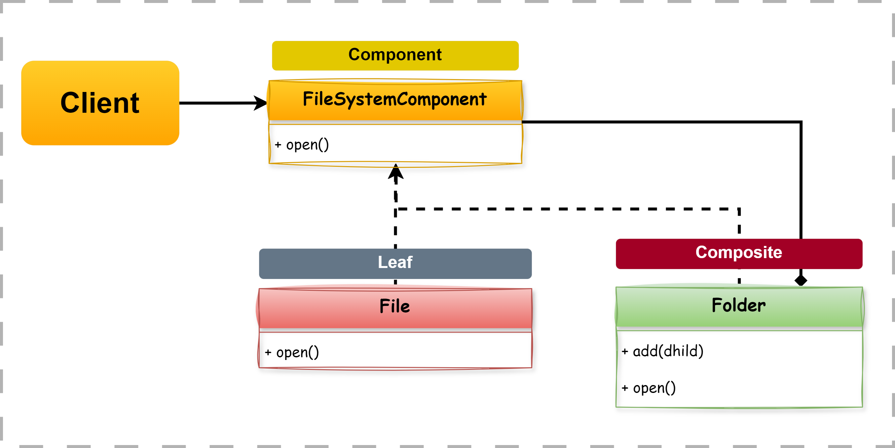

# Structural Design Patterns

## Adapter

<figure><figcaption></figcaption></figure>

> The **Adapter Pattern** is a **structural design pattern** that allows **incompatible interfaces (Classes/Objects)** to work together by **converting one interface into another** that a client expects.

### When to Use

* Integrating a **legacy system** or **third-party library** that doesn’t match your current interface.
* Reusing existing functionality **without modifying source code**.
* Bridging the gap between **new and old systems** with different interfaces.

### The Problem – Payment Gateway Integration

You have a **checkout system** that expects all payment gateways to expose a `pay(amount)` method.

However, a third-party service like **OldPay** or **LegacyPayService** exposes a completely different interface:

* The method name is `make_payment()`
* Requires different arguments

#### Naive Implementation

```python
class LegacyPayService:
    def make_payment(self, value):
        print(f"Paid {value} using LegacyPay.")

# Your system expects this interface:
class Checkout:
    def __init__(self, payment_gateway):
        self.payment_gateway = payment_gateway

    def process_payment(self, amount):
        self.payment_gateway.pay(amount)  # expects 'pay'

# Trying to use LegacyPay directly
payment = LegacyPayService()
checkout = Checkout(payment)  # Will raise AttributeError: 'LegacyPayService' has no 'pay'
checkout.process_payment(100)

```

#### Why Naivety Is a Problem

* The interface (`make_payment`) doesn’t match what the client (`pay`) expects.
* You can’t change `LegacyPayService` (e.g., it’s third-party or legacy).
* No decoupling — tight integration breaks flexibility.

Challenges in Adapting: Interface mismatch, Closed source, Incompatible contracts.

### Enter: Adapter Pattern

#### Two Types of Adapters:

| Type               | Description                                                                                                                |
| ------------------ | -------------------------------------------------------------------------------------------------------------------------- |
| **Object Adapter** | Uses **composition** – wraps the adaptee in a new object and translates interface calls                                    |
| **Class Adapter**  | Uses **inheritance** – adapter subclasses both adaptee and target (works in languages with multiple inheritance, like C++) |

In Python, the **Object Adapter** is most commonly used.

#### Class Diagram

<figure><figcaption></figcaption></figure>

| Component   | Description                                                             |
| ----------- | ----------------------------------------------------------------------- |
| **Client**  | Uses `Target` interface (`pay(amount)`)                                 |
| **Target**  | Interface expected by the client                                        |
| **Adapter** | Converts the interface of the Adaptee to match the Target               |
| **Adaptee** | Existing class with a different interface (e.g., `make_payment(value)`) |

#### Code

```python
# Adaptee (third-party or legacy system)
class LegacyPayService:
    def make_payment(self, value):
        print(f"Paid {value} using LegacyPay.")

# Target Interface (what your system expects)
class PaymentGateway:
    def pay(self, amount):
        raise NotImplementedError

# Adapter
class LegacyPayAdapter(PaymentGateway):
    def __init__(self, legacy_service):
        self.legacy_service = legacy_service

    def pay(self, amount):
        self.legacy_service.make_payment(amount)

# Client (uses Target Interface)
class Checkout:
    def __init__(self, payment_gateway):
        self.payment_gateway = payment_gateway

    def process_payment(self, amount):
        self.payment_gateway.pay(amount)

# Usage
legacy = LegacyPayService()
adapter = LegacyPayAdapter(legacy)
checkout = Checkout(adapter)
checkout.process_payment(100)

```

#### What We Did and Achieved

* Decoupled `Checkout` from specific payment gateways
* Reused legacy code **without modifying it**
* Bridged the mismatch between `pay()` and `make_payment()`
* Achieved **interface compatibility** with clean separation of concerns

### Pros and Cons

| Pros                                                   | Cons                                                  |
| ------------------------------------------------------ | ----------------------------------------------------- |
| Promotes **reusability** of legacy or third-party code | Can add **extra layer of indirection**                |
| No need to modify existing code (adheres to OCP)       | Requires one adapter per incompatible interface       |
| **Improves flexibility and testability**               | Adapter logic may become complex if APIs differ a lot |
| Great for **plug-and-play architecture**               |                                                       |

***

## Bridge

<figure><figcaption></figcaption></figure>

> The **Bridge Design Pattern** is a **structural pattern** that **decouples an abstraction from its implementation**, so they can evolve **independently**.
>
> "Bridge Pattern helps you avoid having a separate class for **every combination** of feature + platform by splitting them into two parts and connecting them via a bridge."

### When to Use

* When a class has **multiple dimensions of variation** (e.g., types of controls and types of devices).
* When you want to **avoid deep inheritance trees**.
* When implementation may **change independently** from the interface.

### The Problem – Remote Controls and Devices

Suppose you have multiple devices (`TV`, `Radio`) and multiple remotes (`BasicRemote`, `AdvancedRemote`). Without bridge:

You’ll need: BasicRemoteForTV, AdvancedRemoteForTV, BasicRemoteForRadio, AdvancedRemoteForRadio
\
→ Combinatorial Explosion!

#### Naive Implementation

```python
class TV:
    def turn_on(self):
        print("TV is ON")
    def turn_off(self):
        print("TV is OFF")

class Radio:
    def turn_on(self):
        print("Radio is ON")
    def turn_off(self):
        print("Radio is OFF")

class BasicRemoteForTV:
    def __init__(self, tv):
        self.tv = tv
    def toggle_power(self):
        self.tv.turn_on()

class BasicRemoteForRadio:
    def __init__(self, radio):
        self.radio = radio
    def toggle_power(self):
        self.radio.turn_on()

# Usage
tv = TV()
remote = BasicRemoteForTV(tv)
remote.toggle_power()

```

#### Why It’s a Problem

* Code duplication for each device + remote pair
* Inflexible and hard to maintain
* Deep inheritance tree as variations grow
* What We Really Need: A way to **separate the remote control (abstraction)** from the **device (implementation)** and allow combinations at runtime.

### Enter: Bridge Pattern

The Bridge Pattern splits a class into **two independent hierarchies**:

* **Abstraction** (e.g., Remote)
* **Implementation** (e.g., Device)

...and connects them using **composition**, not inheritance.

#### Class Diagram

<figure><figcaption></figcaption></figure>

<table><thead><tr><th width="273">Component</th><th>Description</th></tr></thead><tbody><tr><td><strong>Abstraction</strong></td><td>Interface that defines high-level operations (e.g., Remote)</td></tr><tr><td><strong>Refined Abstraction</strong></td><td>Extended version of Abstraction (e.g., AdvancedRemote)</td></tr><tr><td><strong>Implementor</strong></td><td>Interface for low-level operations (e.g., Device)</td></tr><tr><td><strong>Concrete Implementor</strong></td><td>Concrete classes implementing device behavior (e.g., TV, Radio)</td></tr></tbody></table>

#### Code

```python
# Implementor Interface
class Device:
    def turn_on(self): pass
    def turn_off(self): pass

# Concrete Implementors
class TV(Device):
    def turn_on(self):
        print("TV is ON")
    def turn_off(self):
        print("TV is OFF")

class Radio(Device):
    def turn_on(self):
        print("Radio is ON")
    def turn_off(self):
        print("Radio is OFF")

# Abstraction
class Remote:
    def __init__(self, device: Device):
        self.device = device
        self.is_on = False

    def toggle_power(self):
        if self.is_on:
            self.device.turn_off()
            self.is_on = False
        else:
            self.device.turn_on()
            self.is_on = True

# Refined Abstraction
class AdvancedRemote(Remote):
    def mute(self):
        print("Device muted.")

# Usage
tv = TV()
radio = Radio()

remote1 = Remote(tv)
remote2 = AdvancedRemote(radio)

remote1.toggle_power()       # TV is ON
remote1.toggle_power()       # TV is OFF
remote2.toggle_power()       # Radio is ON
remote2.mute()               # Device muted.

```

#### Output:

```vbnet
TV is ON
TV is OFF
Radio is ON
Device muted.
```

#### What We Achieved

* Separated interface (Remote) from implementation (Device)
* Easily extended on either side independently
* No combinatorial explosion of classes
* Flexible runtime composition

### Pros and Cons

| Pros                                                   | Cons                                         |
| ------------------------------------------------------ | -------------------------------------------- |
| Decouples abstraction from implementation              | Adds slight complexity via extra layers      |
| Easy to **extend or change** parts independently       | Requires good planning of abstraction levels |
| Avoids class explosion with multi-dimensional features | May be overkill for very simple scenarios    |
| Good for platform-specific variations (e.g., UI, APIs) |                                              |

***

## Composite

<figure><figcaption></figcaption></figure>

> The **Composite Pattern** is a **structural design pattern** that lets you **treat individual objects and compositions of objects uniformly**.
>
> "It allows you to treat a **single file** and a **folder of files** the same way — so you don't need to write separate logic for one vs. many."

### When to Use

* When you need to **represent part-whole hierarchies** (e.g., folders and files, shapes inside groups).
* When you want to **treat individual and grouped objects** uniformly.
* To **avoid complex branching logic** in client code.

### The Problem – File System

Let’s say you’re building a file explorer. Some files are **individual files**, others are **folders** containing files.

```python
class File:
    def __init__(self, name):
        self.name = name

    def open(self):
        print(f"Opening file: {self.name}")

class Folder:
    def __init__(self, name):
        self.name = name
        self.children = []

    def add(self, item):
        self.children.append(item)

    def open(self):
        print(f"Opening folder: {self.name}")
        for child in self.children:
            if isinstance(child, File):
                child.open()
            elif isinstance(child, Folder):
                child.open()

# Client code
f1 = File("file1.txt")
f2 = File("file2.txt")
folder = Folder("Docs")
folder.add(f1)
folder.add(f2)
folder.open()

```

#### Why It’s a Problem

* Client or composite (`Folder`) has to manually check `isinstance()` to treat leafs and composites differently.
* This violates **Open/Closed Principle** and is harder to extend.
* Repeating logic across multiple composite nodes.

### Enter: Composite Pattern

Instead of handling `File` and `Folder` separately, we define a **common interface**, and treat both as `Component`s. This lets us **invoke `.open()`** on a `File` or a `Folder` **without worrying which one it is**.

#### Class Diagram

<figure><figcaption></figcaption></figure>

| Component     | Description                                                      |
| ------------- | ---------------------------------------------------------------- |
| **Client**    | Uses the component interface to interact with both files/folders |
| **Component** | Abstract interface (`open()`) common to both leaf and composite  |
| **Leaf**      | `File` – Implements `open()` directly                            |
| **Composite** | `Folder` – Stores children and delegates calls to them           |

#### Code

```python
from abc import ABC, abstractmethod

# Component Interface
class FileSystemComponent(ABC):
    @abstractmethod
    def open(self):
        pass

# Leaf
class File(FileSystemComponent):
    def __init__(self, name):
        self.name = name

    def open(self):
        print(f"Opening file: {self.name}")

# Composite
class Folder(FileSystemComponent):
    def __init__(self, name):
        self.name = name
        self.children = []

    def add(self, component: FileSystemComponent):
        self.children.append(component)

    def open(self):
        print(f"Opening folder: {self.name}")
        for child in self.children:
            child.open()

# Client Code
f1 = File("file1.txt")
f2 = File("file2.txt")
f3 = File("file3.txt")

docs = Folder("Docs")
docs.add(f1)
docs.add(f2)

images = Folder("Images")
images.add(f3)

root = Folder("Root")
root.add(docs)
root.add(images)

root.open()

```

#### Output

```
Opening folder: Root
Opening folder: Docs
Opening file: file1.txt
Opening file: file2.txt
Opening folder: Images
Opening file: file3.txt
```

#### What We Achieved

* **Uniform treatment** of both files and folders
* Clean and recursive design without `isinstance()` checks
* Easy to add new node types (e.g., Symlink) by just implementing the `Component` interface
* Adheres to **Open/Closed Principle**

### Pros and  Cons

| Pros                                            | Cons                                             |
| ----------------------------------------------- | ------------------------------------------------ |
| Treats **single and grouped objects uniformly** | Can be **overkill** for simple flat structures   |
| Encourages clean recursive logic                | Slightly more **boilerplate** due to interfaces  |
| Simplifies **client code**                      | Needs careful design to prevent circular nesting |
| Easy to extend and refactor                     |                                                  |

***

## Decorator &#x20;

<figure><figcaption></figcaption></figure>

> The **Decorator Pattern** is a **structural pattern** that lets you **dynamically add new behavior** or responsibilities to an object **without modifying its structure or code**.\
> \
> "It’s like gift-wrapping an object: you still have the same object inside, but you can add as many layers (decorators) around it as you like—each adding new functionality."

### When to Use

* To **extend the functionality** of a class without subclassing it
* To **compose behaviors at runtime** in different combinations
* To avoid **bloated classes** with multiple `if/else` flags for optional features

### The Problem – Social Notifications&#x20;

You have a system that sends notifications to users. Sometimes they get only email, other times email + SMS, or all platforms (email + Slack + Instagram...).

<pre class="language-python"><code class="lang-python">class Notifier:
    def __init__(self, use_sms=False, use_slack=False, use_facebook=False):
        self.use_sms = use_sms
        self.use_slack = use_slack
        self.use_facebook = use_facebook

    def send(self, message):
        print(f"Sending Email: {message}")

        if self.use_sms:
            print(f"Sending SMS: {message}")
        
        if self.use_slack:
            print(f"Sending Slack message: {message}")
        
        if self.use_facebook:
            print(f"Sending Facebook message: {message}")

# Client Code
# Send only email
notifier1 = Notifier()
notifier1.send("Welcome to the platform!")

# Send email + SMS
notifier2 = Notifier(use_sms=True)
notifier2.send("You have a new alert!")

# Send email + all platforms
notifier3 = Notifier(use_sms=True, use_slack=True, use_facebook=True)
notifier3.send("Big news: Major update released!")

============================================================
Output
Sending Email: Welcome to the platform!

Sending Email: You have a new alert!
Sending SMS: You have a new alert!

Sending Email: Big news: Major update released!
Sending SMS: Big news: Major update released!
<strong>Sending Slack message: Big news: Major update released!
</strong>Sending Facebook message: Big news: Major update released!

</code></pre>

#### **Why It's a Problem**

* Hardcoded logic makes it **non-extensible**
* Adding/removing platforms requires changing the core class
* **Violates Open/Closed Principle**
* Combinations require multiple flags or subclasses

### Enter: Decorator Pattern

We define a **core component** (`Notifier`) and then decorate it dynamically at runtime with new responsibilities (`SMSDecorator`, `SlackDecorator`, etc.).

#### Class Diagram

<figure><figcaption></figcaption></figure>

| Component                | Description                                                      |
| ------------------------ | ---------------------------------------------------------------- |
| **Client**               | Uses the `Notifier` interface                                    |
| **Component**            | Common interface for all notifiers (`send(message)`)             |
| **Concrete Component**   | Base notifier (e.g., `EmailNotifier`)                            |
| **Decorator (abstract)** | Holds reference to a `Notifier`; implements same interface       |
| **Concrete Decorators**  | Add functionality like SMS, Slack, etc. around the base notifier |

#### Code

```python
from abc import ABC, abstractmethod

# Component
class Notifier(ABC):
    @abstractmethod
    def send(self, message): pass

# Concrete Component
class EmailNotifier(Notifier):
    def send(self, message):
        print(f"Sending Email: {message}")

# Decorator (abstract)
class NotifierDecorator(Notifier):
    def __init__(self, wrappee: Notifier):
        self.wrappee = wrappee

    def send(self, message):
        self.wrappee.send(message)

# Concrete Decorators
class SMSDecorator(NotifierDecorator):
    def send(self, message):
        super().send(message)
        print(f"Sending SMS: {message}")

class SlackDecorator(NotifierDecorator):
    def send(self, message):
        super().send(message)
        print(f"Sending Slack message: {message}")

class FacebookDecorator(NotifierDecorator):
    def send(self, message):
        super().send(message)
        print(f"Sending Facebook message: {message}")

# Client Code
notifier = EmailNotifier()
notifier = SMSDecorator(notifier)
notifier = SlackDecorator(notifier)
notifier = FacebookDecorator(notifier)

notifier.send("New promotion available!")

```

Output

```
Sending Email: New promotion available!
Sending SMS: New promotion available!
Sending Slack message: New promotion available!
Sending Facebook message: New promotion available!
```

#### What We Achieved

* Added new behaviors **without modifying base class**
* Flexible and composable - decorators can be **stacked dynamically**
* Adheres to **Open/Closed Principle**
* Clean and scalable for adding new channels

### Pros and Cons

| Pros                                            | Cons                                                      |
| ----------------------------------------------- | --------------------------------------------------------- |
| Add behavior **without changing existing code** | Many small classes can clutter the codebase               |
| **Flexible combinations** of functionality      | Debugging layered decorators may be harder                |
| Follows **Open/Closed Principle**               | Execution order can affect results if not managed clearly |
| Can be added or removed **at runtime**          | Adds runtime overhead with multiple wrappers              |

***

## Facade&#x20;


***

## Flyweight


***

## Proxy&#x20;

###

***

## &#x20;References
