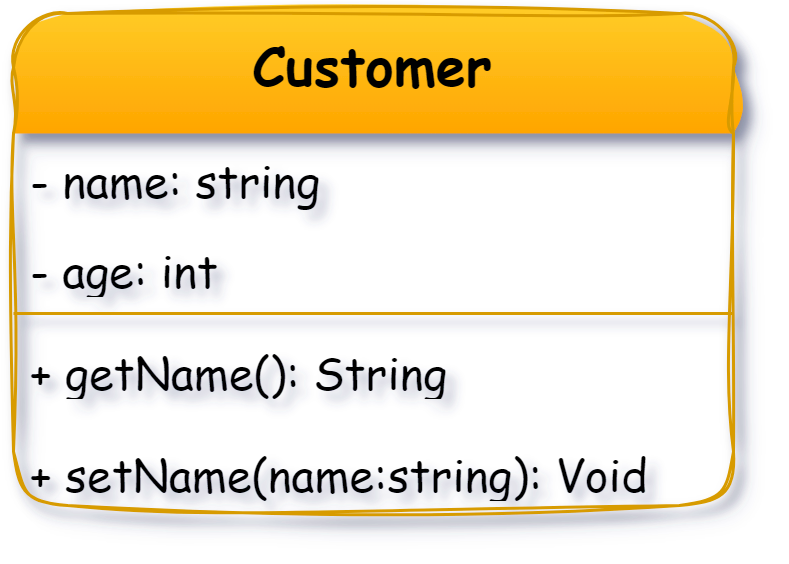
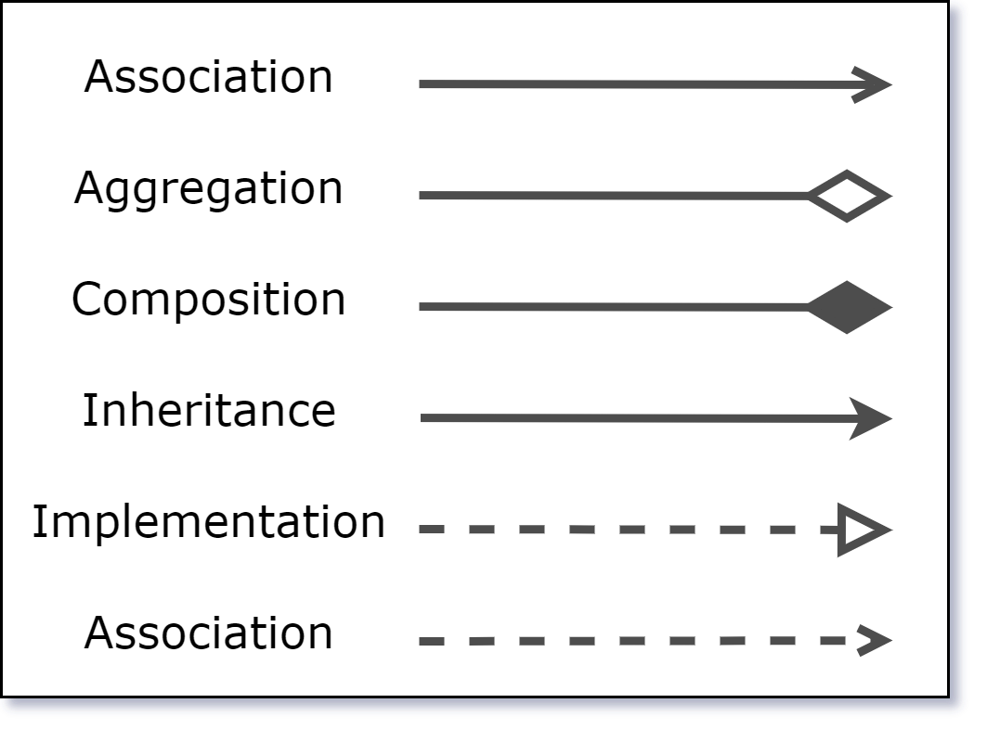

# UML & Class Diagrams

The acronym **UML** stands for **Unified Modeling Language**. UML is a standardized visual modeling language used to provide a common way to visualize the design of software or systems. It helps developers, architects, and stakeholders specify, visualize, construct, and document the structure and behavior of software systems using a set of graphical diagrams

UML diagrams are divided into two main categories

* **Structural Diagrams:** Show the static structure of a system—its components, classes, objects, and their relationships.
* **Behavioral Diagrams:** Illustrate the dynamic aspects of a system—how components interact and behave over time.

Among all UML diagrams, the **Class Diagram** is the most widely used and fundamental in object-oriented design&#x20;

### Class Diagram

> Static structure diagram in UML that represents the structure of a system by showing its classes, their attributes (properties), methods (operations), and the relationships between classes.

<figure><figcaption>
<a href="https://www.visual-paradigm.com/guide/uml-unified-modeling-language/uml-class-diagram-tutorial/">source</a>
</figcaption></figure>

Each class is depicted as a rectangle divided into three compartments:

* **Class Name:** The top section, showing the name of the class.
* **Attributes:** The middle section, listing the properties or data fields.
* **Methods: The bottom section lists the operations or functions the class can perform.**
* **Visibility:**
  * `+` Public
  * `-` Private
  * `#` Protected
  * `~` Package

<figure><figcaption></figcaption></figure>

Class diagrams also illustrate various relationships between classes, such as:

<figure><figcaption></figcaption></figure>

* **Association:** A general connection between classes.&#x20;
  * **Example:** A `Student` class is associated with a `Course` class, as a student can enroll in multiple courses.
* **Aggregation:** A "has-a" relationship where the part can exist independently.
  * **Example:** A `Car` class has an `Engine` class but the Engine class can exist without the Car class.
* **Composition:** A strong "has-a" relationship where the part cannot exist without the whole.
  * **Example:** A `House` class is composed of `Room` class but the Room class can not exist without the House class.
* **Inheritance (Generalization):** An "is-a" relationship where subclasses inherit from a superclass.
  * **Example:** A `Dog` class and a `Cat` class inherit from an `Animal` class, as both dogs and cats are animals.
* **Implementation:  An "is-a"** relationship between a class and interface, where class implements the methods in the interface.
  * **Example:** A `Rectangle` class and a `Circle` class implement the `Shape` interface, which declares a `getArea()` method.
* **Dependency:** Indicates one class uses or depends on another.
  * **Example:** A `Customer` class uses an `Order` class to place order.

### References:



[https://blog.algomaster.io/p/uml-class-diagram-explained-with-examples](https://blog.algomaster.io/p/uml-class-diagram-explained-with-examples) \
\
