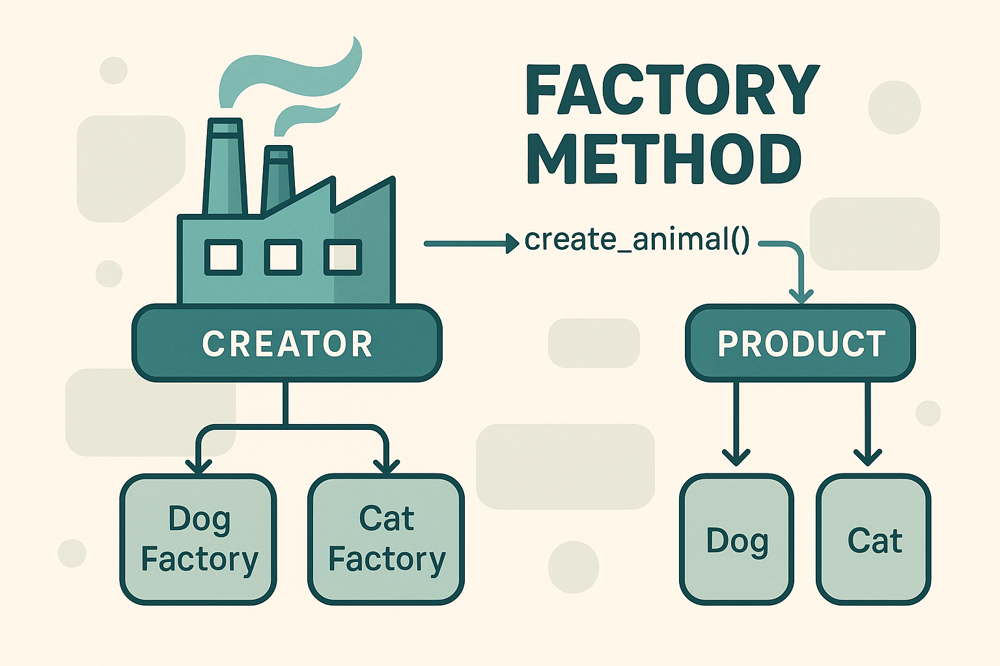

# Supervised Learning

### Regression vs Classification

<figure><figcaption><p><a href="https://www.google.com/url?sa=i&#x26;url=https%3A%2F%2Fmedium.com%2Fenjoy-algorithm%2Fclassification-and-regression-problems-in-machine-learning-83b8fc9ab958&#x26;psig=AOvVaw0jVhI-3Wgx9i5kk11pFoNf&#x26;ust=1745116193600000&#x26;source=images&#x26;cd=vfe&#x26;opi=89978449&#x26;ved=0CBcQjhxqFwoTCOCJu-GG44wDFQAAAAAdAAAAABAE">source</a></p></figcaption></figure>

### Binary vs MultiClass  vs MultiLabel classification

<figure><figcaption><p><a href="https://www.microsoft.com/en-us/research/uploads/prod/2017/12/40250.jpg">source</a> </p></figcaption></figure>

### Linear Regression

> Linear Relationship between dependent variable (Outcome/target) variable and one or more independent (predictor) variables.

#### Assumptions / Conditions

<table><thead><tr><th width="204.88909912109375">Assumption</th><th>Description</th></tr></thead><tbody><tr><td>Linearity</td><td>Relationship between features and target is linear</td></tr><tr><td>Homoscedasticity</td><td>Constant variance of errors</td></tr><tr><td>No Multicollinearity</td><td>Features are not highly correlated</td></tr><tr><td>Independence</td><td>Observations are independent</td></tr><tr><td>Normality</td><td>Residuals are normally distributed</td></tr></tbody></table>

#### Target

$$
y = \beta_0 + \beta_1x_1 + \beta_2x_2 + \dots + \beta_nx_n + \epsilon
$$

#### Predicted

$$
\hat{y} = \hat{\beta_0} + \hat{\beta_1}x_1 + \hat{\beta_2}x_2 + \dots + \hat{\beta_n}x_n
$$

#### MSE (Cost function)

$$
J(\theta) = \frac{1}{n} \sum_{i=1}^{n} (\hat{y}_i - y_i)^2
$$

<figure><figcaption><p><a href="https://www.google.com/url?sa=i&#x26;url=https%3A%2F%2Fwww.grammarly.com%2Fblog%2Fai%2Fwhat-is-linear-regression%2F&#x26;psig=AOvVaw0pnHvr-AfbJx31Pjh2MC1H&#x26;ust=1745114558325000&#x26;source=images&#x26;cd=vfe&#x26;opi=89978449&#x26;ved=0CBcQjhxqFwoTCPDhs72A44wDFQAAAAAdAAAAABAK">A simple line of best fit minimizing squared error</a> </p></figcaption></figure>

#### Code Sample

```python
from sklearn.linear_model import LinearRegression
from sklearn.datasets import make_regression

# Create dummy data
X, y = make_regression(n_samples=100, n_features=1, noise=15)

# Fit the model
model = LinearRegression()
model.fit(X, y)
y_pred = model.predict(X)

```

#### Loss Functions

* Mean Squared Error (MSE)
* Mean Absolute Error (MAE)

Evaluation Metrics

* R² Score
* Root Mean Squared Error
* MAE

Optimization Techniques

* **Gradient Descent**
* **Normal Equation** (Analytical Solution)
* L1 (Lasso) & L2 (Ridge) Regularization

#### Common Issues

<table><thead><tr><th width="215.21514892578125">Issue</th><th>Description</th></tr></thead><tbody><tr><td>Overfitting</td><td>Especially with too many features</td></tr><tr><td>Underfitting</td><td>When model is too simple</td></tr><tr><td>Outliers</td><td>Can distort the line</td></tr><tr><td>Collinearity</td><td>Leads to unstable coefficients</td></tr><tr><td>Assumption Violations</td><td>Leads to incorrect inferences</td></tr></tbody></table>

Further Reading: [https://mlu-explain.github.io/linear-regression/](https://mlu-explain.github.io/linear-regression/)

***

### Logistic Regression

> Predicts the probability of categorical variables (Classes) based on Input features.
>
> It models the relationship using the **logit (log-odds)** function instead of a straight line.
>
> _Common application_ : _Outcome can belong to **one or two classes.**_ [<sup><sub>**Binary classification**<sub></sup>](https://en.wikipedia.org/wiki/Binary_classification)
>
> Also extended to: predict multiple classes/labels ([OneVsRestClassifier](https://scikit-learn.org/stable/modules/generated/sklearn.multiclass.OneVsRestClassifier.html)) . [<sup><sub>**Mulit class classification**<sub></sup>](https://en.wikipedia.org/wiki/Multiclass_classification)<sup><sub>**,**<sub></sup> [<sup><sub>**Mulit label classification**<sub></sup>](https://en.wikipedia.org/wiki/Multi-label_classification)

