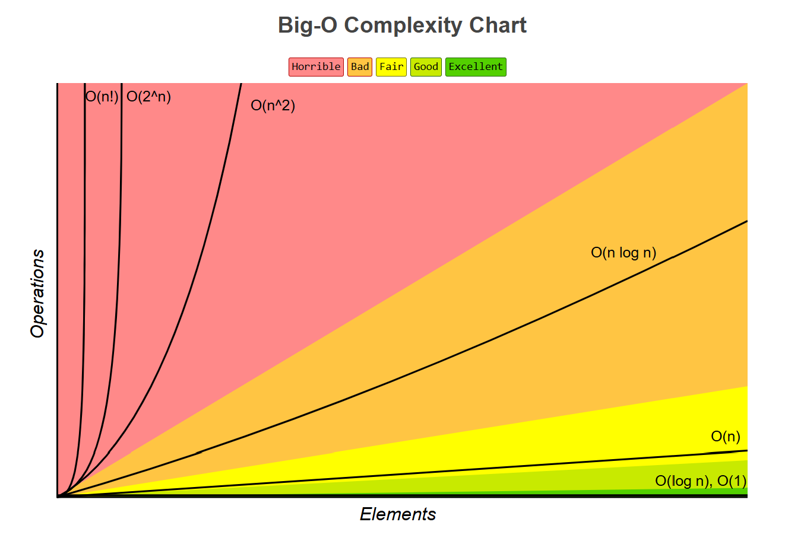
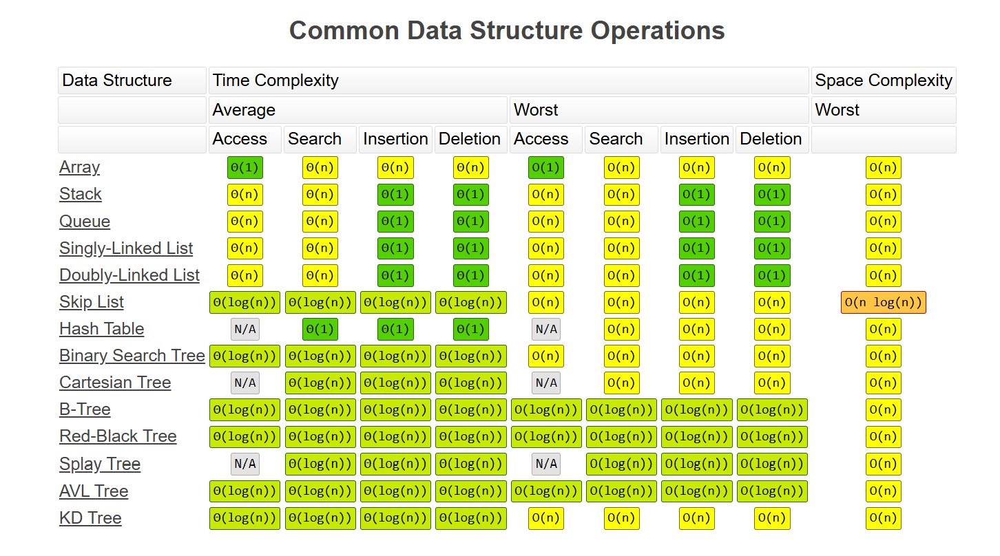
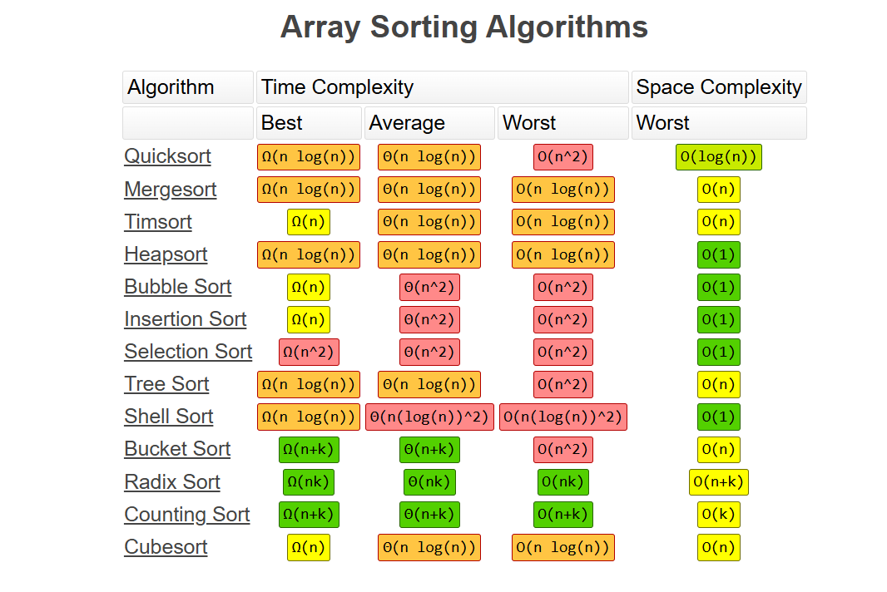

# Performance Tips

### Generator vs List (using `yield`)

<table><thead><tr><th width="157.00836181640625">Feature</th><th>Generator</th><th>List</th></tr></thead><tbody><tr><td><strong>Memory Usage</strong></td><td>Low, because data is generated on demand</td><td>High, as all elements are stored in memory</td></tr><tr><td><strong>Speed</strong></td><td>Faster for large data, as items are produced one at a time</td><td>Slower for large data, as all items are processed and stored</td></tr><tr><td><strong>Iteration</strong></td><td>One-time iteration (can't reuse)</td><td>Multiple iterations are possible</td></tr><tr><td><strong>Syntax</strong></td><td>Uses <code>yield</code> keyword</td><td>Standard list comprehension or manual appending</td></tr><tr><td><strong>Access</strong></td><td>Sequential access only</td><td>Random access is possible</td></tr><tr><td><strong>Use Case</strong></td><td>When processing large datasets or streaming data</td><td>When you need random access or need to store the entire dataset</td></tr></tbody></table>

```python
# Using generator
def generate_numbers(n):
    for i in range(n):
        yield i

gen = generate_numbers(5)
for num in gen:
    print(num)

# Using list
numbers = [i for i in range(5)]
print(numbers)
```

### Time and Space Complexity

<figure><figcaption><p><a href="https://www.bigocheatsheet.com/">source</a></p></figcaption></figure>

<figure><figcaption><p><a href="https://www.bigocheatsheet.com/">source</a></p></figcaption></figure>

<figure><figcaption><p><a href="https://www.bigocheatsheet.com/">source</a></p></figcaption></figure>

***

### Memory Profiling (Using `memory_profiler` Module)

Memory Profiling is an important aspect of performance optimization, so **to monitor the memory usage of our code**, we use the `"memory_profiler"` module that Python provides.

`@profile` or `mprof` command, we can check usage line by line.

```python
from memory_profiler import profile

@profile
def my_func():
    a = [i * 2 for i in range(1000)]
    b = [i * 3 for i in range(1000)]
    return a, b

if __name__ == "__main__":
    my_func()

```

***

### Least Recently Used (LRU) Caching technique

**caching** techniques are powerful technique to optimize performance. The `functools.lru_cache` Decorator is a simple and powerful way to cache the results of expensive function calls. This is particularly useful for functions repeatedly called with the same arguments.&#x20;

The **Least Recently Used (LRU)** caching mechanism ensures that only a limited number of results are stored, so the cache does not consume excessive memory. When a function is called with already cached arguments, it returns the cached result instead of recalculating the result.

```python
from functools import lru_cache

@lru_cache(maxsize=128)
def expensive_function(n):
    print(f"Calculating {n}")
    return n * 2

# First call, will calculate and cache
print(expensive_function(5))  # Output: Calculating 5, 10

# Second call with the same argument, will use the cached result
print(expensive_function(5))  # Output: 10 (no "Calculating" print)

```

***

Performance optimization is a broad area, and I have just touched the surface. The optimization always depends on the problem we are solving. The right tool or techniques come in hand in hand for a performance-critical application.\
Please refer to this [<sup>Python page</sup>](https://wiki.python.org/moin/PythonSpeed/PerformanceTips) for more detailed tips.
